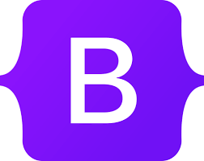

### 

I'm **a self-taught programmer** since 2020, My goal is to become a **Full Stack Web Developer**. Using **Github**, I going to show you how **consistent** I am in terms of my learning to become a **Full Stack Web Developer**. 

To Track my learnings I'm going to post/commit some projects coding here in my GitHub account.

### 
**Name:** Matthew David Fernandez  
**Age:** 18 yrs old  
**Birthday:** April 28 2006  
**Nationality:** Filipino  
**City:** Muntinlupa City  
**College Year:** 1st Year  
**Course:** BSCS/ComSci (Bachelor of Science in Computer Science)  
**College:** Pamantasan lungsod ng muntinlupa (PLMUN)  

### 
- 👨🏽‍💻 *Learning programming concepts and it/web related*  
- ♟️ *Playing Chess*  
- 🎮 *Playing online games like League of Legends and Valorant*  

### 

### 
 
     

- *HTML*
- *CSS*
    - *SCSS (Syntactically Awesome Style Sheets)*
    - *BOOTSTRAP 5*
- *JAVASCRIPT*
    - *JSX*
    - *ECMASCRIPT 6+*
    - *DOM (DOCUMENT OBJECT MODEL)*
- *PYTHON*
    - *DJANGO*
- *NC II PASSER CSS (COMPUTER SYSTEM SERVICING)*
- *JAVA*

#### REFERENCES:
***Python, Matplotlib, and Django*** - I learned them through reading a book and doing exercises in Python crash course 2nd edition by Eric Matthes and watching some YouTube videos by [freeCodeCamp.org](https://www.youtube.com/@freecodecamp) and [Caleb Curry](https://www.youtube.com/@codebreakthrough)

***JAVA*** - This is our computer programming subject in grade 11 senior high school.

 

***NC2 CSS(NATIONAL CERTIFICATE 2, COMPUTER SYSTEM SERVICING)*** - I'm the one who picked our school to be a scholar in TESDA to get a NC2 CSS, and I train and am assessed at St. Benadette College of Alabang. Our teacher is Mr. Daryl Daven, and I remember our assessor, Joey M. Moreto, who is such a serious and cold-blooded person. 3 out of 8 students just passed the certificate, and I am the one who passed the assessment. This is my NC2 Certificate [NC2 CSS](certifications/NC.pdf) the ***PASSWORD*** is ***04282006F***

***SCSS, BOOTSTRAP5, DOM, JSX*** - I watch tutorial videos from net ninja and freecodecamp.org. Lately ive been really focusing on the frontend development i do some projects here and sooner i will post it in here in my github.

### 
- *React js*
- *ASYNC js*
- *Reading Cracking the Coding Interview - 189 Programming Questions and Solutions (6th Edition)*
- *Reading Computer problems in python by david kopec*
- *Solving leetcode problems*

### 

- Full Stack Development
- Relational and Non-Realational databases like mySQL and MongoDB
- Comptia Certification 
- AI (Artificial intelligence, openAi library python)
- Machine Learning 

### 
- [Facebook](https://web.facebook.com/Matthew.act546)
- [Discord](https://discord.com/users/1028176822485139517)
- Gmail: **matthewyt765@gmail.com**
