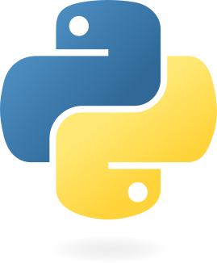
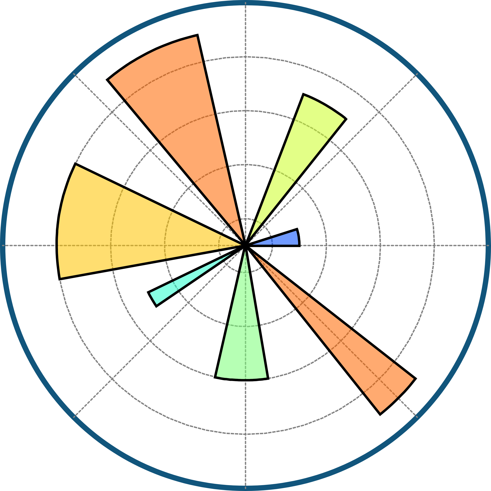
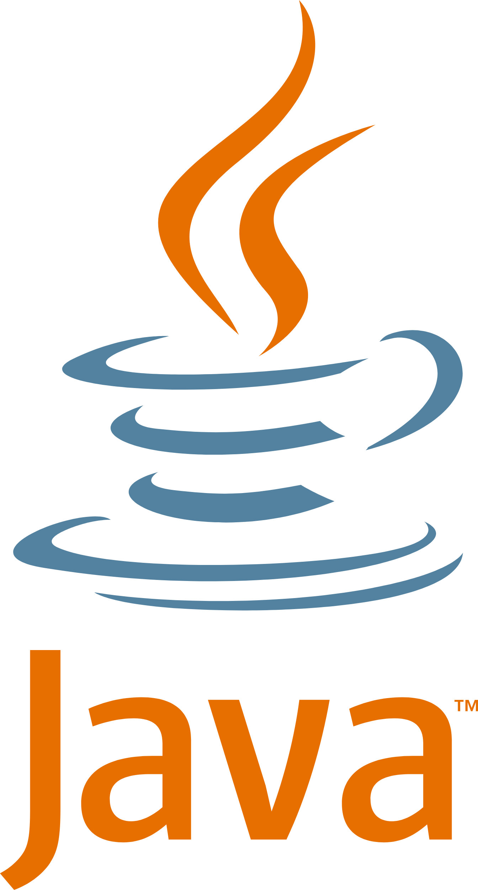
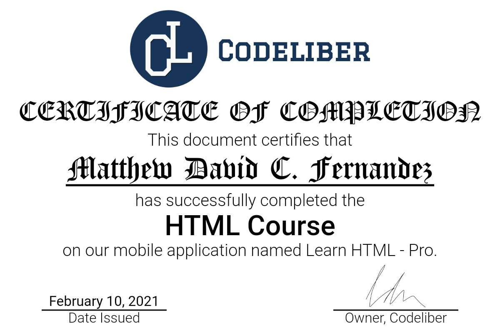
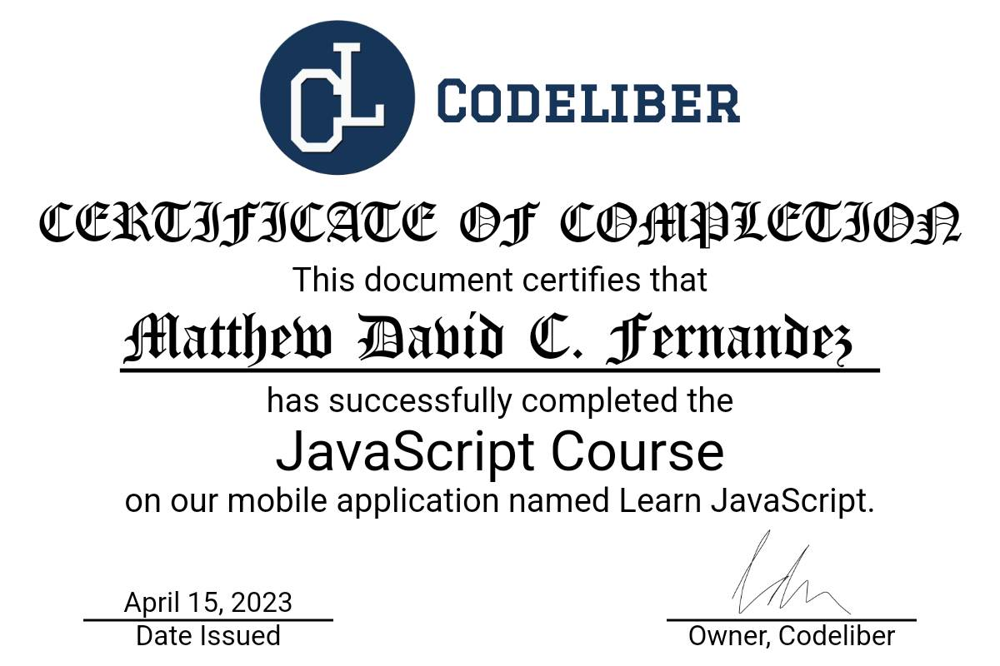

### Hi there 👋, I'm Matthew

I'm **self-taught programmer** since 2020, My goals is to become a **Full Stack Web Developer**. Using **Github**, I gonna show you how **consistent** i am in terms of my learning to become a **Full Stack Web Developer**. 

To Track my learnings im gonna post/commit some projects coding here in my github account.

### 💬 INFORMATION
**Name:** Matthew David Fernandez  
**Age:** 17 yrs old  
**Birthday:** April 28 2006  
**Nationality:** Filipino  
**City:** Muntinlupa City  
**Grade level:** Grade 12  
**Strand:** ICT (Information Communication Technology)

### ❤️ HOBBY
- 👨🏽‍💻 *Learning programming concepts and it/web related*  
- ♟️ *Playing chess*  
- 🎮 *Playing online games like league of legends and valorant*  

### Skills

- *HTML*
- *CSS*
- *JAVASCRIPT*
- *PYTHON*
    - *DJANGO*
    - *MATPLOTLIB*
- *JAVA*

#### REFERENCES:
***Python, Matplotlib, and Django*** - I learn it through reading a book and doing exercises of python crash course 2nd edition by Eric Matthes and watches some youtube videos by [freeCodeCamp.org](https://www.youtube.com/@freecodecamp) and [Caleb Curry](https://www.youtube.com/@codebreakthrough)

***JAVA*** - This is mycomputer programming subject in grade 11 senior high school

### 🌱 I’m currently learning ...
- *Bootstrap 5*
- *Sass (Syntatically Awesome Style Stylesheets)*
- *Algorithm & Data Structure*
- *In depth of github(Version control system)*

### 📫 How to reach me: ...
- [Facebook](https://web.facebook.com/Matthew.act546)
- [Discord](https://discord.com/users/1028176822485139517)
